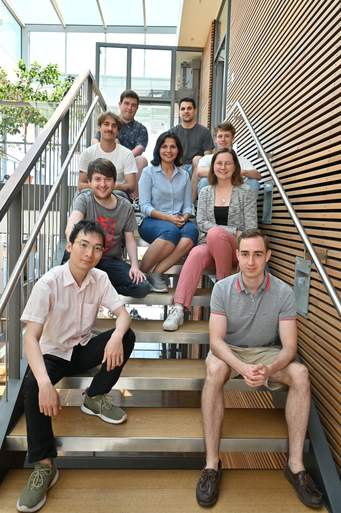

## Welcome to Elhabashy Lab GitHub page 
**University of Bayreuth** • **Max Planck Institute for Biology Tübingen**. 
**https://elhabashylab.org/**

  

  

We are a multidisciplinary group of computational biophysicists, bioinformaticians, and machine learning researchers

We seek to understand biological life at the molecular level.  

We draw on physics, mathematics, molecular biology, evolution, and artificial intelligence.  

We integrate these disciplines into rigorous, scalable pipelines that generate testable predictions. 

We build tools accessible enough for the broader scientific community to use. 

